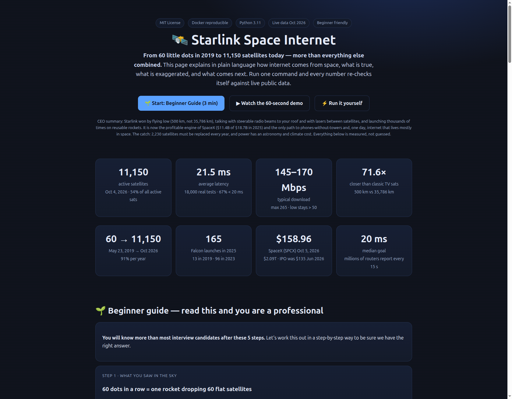
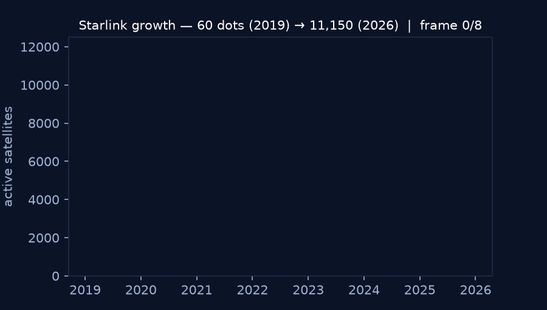
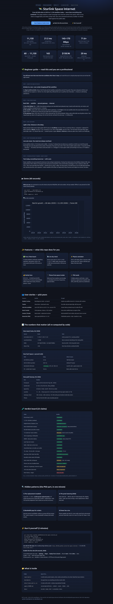

# 🛰️ Starlink Space Internet — From 60 Dots to 11,150 Satellites, Explained So Simply Anyone Gets It

> One line: **how internet comes from space, what is true, what is hype, and how to check every number yourself in 2 minutes.**

[](LICENSE)


**🌐 Live website (click and read like a site): https://m0-ar.github.io/starlink-space-internet/preview.html** — same story as below, as a beautiful page (`docs/preview.html` + `docs/index.html` + root `preview.html`). If the short link 404s, always use the full `/preview.html` path.

## CEO summary — 30 seconds, the whole story

**Starlink won by flying low (500 km, not 35,786 km), steering radio beams with electricity instead of motors, linking satellites with lasers over oceans, and launching thousands of times on reusable rockets.** From 60 satellites on May 23, 2019 it grew to **11,150 active (54% of everything in orbit)** by Oct 2026, with real-world **21.5 ms latency and 145–170 Mbps** — good enough for calls and games from the middle of nowhere. It is now the profitable engine of SpaceX (**$11.4B of $18.7B in 2025**) and the only path to texting without towers. The catch: **~2,230 satellites must be replaced every year**, and extra power has an astronomy + climate cost. Every number below re-checks itself when you run one command.

<p align="center">
  
</p>
<p align="center">
  <br>
  <em>Growth: 120 (2019) → 1,000 → 1,900 → 3,500 → 5,000 → 6,400 → 9,400 → 11,150 (2026). Generated from the same data the code checks.</em>
</p>

**▶ 60-second demo:** run the check, see the numbers. Video: record your screen for 60 s (`install → run → show 21.5 ms + 11,150 + $158.96`), save as `docs/demo.mp4`, link it here. The GIF above is the automated preview until your video lands.

---

## 🌱 Beginner guide — read this and you are a professional

> You will know more than most interview candidates after these 5 steps. Let's work this out in a step-by-step way to be sure we have the right answer.

### Step 1 · What you saw in the sky: 60 dots = one rocket dropping 60 flat satellites

On **May 23, 2019 at 22:30** a Falcon 9 left Florida with 60 satellites stacked like cards (227 kg each). Released at 440 km, they climbed with ion engines to ~550 km. For a few nights they reflected the sun in a perfect train. Not aliens — a factory being switched on.

### Step 2 · The 3-piece chain: roof dish → satellite → ground gateway → internet

**1) Your dish.** Flat, 1,000+ tiny antennas acting as one beam that steers with electricity (no motor). It follows a satellite crossing the sky in ~5 minutes.

**2) The satellite.** Listens with radio. Sends down with radio to gateways — or with **laser** to the next satellite when ocean blocks the view (Earth curves: at 500 km you cannot see your dish and a far gateway at once, so satellites relay).

**3) The gateway.** 100+ sites in the US (1,500+ antennas) + 150–200 worldwide. Dishes under white balls, often next to big data centers. Your click goes up → down → into normal internet → back the same way, in milliseconds.

### Step 3 · Why low wins: light is fast, distance is the delay

Radio and laser both move at light speed. Old TV sats at **35,786 km**: 119 ms up, 239 ms round-trip = awkward pause. Starlink at **500 km**: 1.7 ms up, 3.3 ms round-trip = feels instant. That is **71.6× closer**. Glass fiber also slows light (index 1.47), so laser in vacuum is **30–47% faster** than fiber for the same distance. New York → London: **18.6 ms by space laser vs 30.6 ms by cable route**.

### Step 4 · Why thousands are needed: low sats move

A low satellite circles in **~95 minutes** and is visible **~5 minutes**. To always have one overhead, anywhere, you need thousands. Three high sats cover Earth (minus poles) but slowly. Thousands of low sats cover it fast. Hence launches: **13 (2019) → 96 (2023) → 165 (2025)**. Each Falcon carries 60 small v1 or ~20 bigger V2. The next giant rocket carries 60 big V3 at once (**~61 Terabits** in one launch).

### Step 5 · Phones without towers: text today, everything tomorrow — with costs

New sats carry extra-strong antennas to hear whisper-weak phones. **Texting from dead zones is live** (US/New Zealand, 400+ sats, approved Nov 2024, millions of emergency texts in hurricanes/fires). Voice + full data need bigger V3 sats. Undersea cables still carry **~100× more total data** — Starlink wins on **reach + delay**, not total volume. Filed future: up to 42,000 sats + giant launches + a separate 1-million AI-sat file (filed, not approved). Moon factories + railguns are stories, not plans.

---

## ⚡ Quick start — 2 minutes to “it works”

```bash
git clone https://github.com/M0-AR/starlink-space-internet.git
cd starlink-space-internet
pip install -r requirements.txt
python benchmarks/run_benchmarks.py
# same result everywhere:
docker compose up --build
```

You will see 6 checks + a verdict table. No key needed. Offline it uses pinned Oct 2026 values (clearly labeled).

**Open the live site locally:** open `preview.html` in your browser, or `docs/index.html` — that is exactly what GitHub Pages shows.

---

## ✨ Features — what you can do with this repo

- **✅ True / False board** — 23 claims labeled confirmed / simplified / optimistic / vision / story. Never guess what to trust.
- **📡 Live sky check** — active vote (11,150 / 11,149 / 11,122 / 11,080), shells, launched total 12,988, 54% concentration.
- **⚡ Physics calculator** — type an altitude, get delay, orbit period, pass time. Answer any latency question cold.
- **💰 Market lens** — IPO $135 → $158.96 live ($2.09T), Starlink 61% of revenue and profitable while rockets lose money.
- **📱 Phone-from-space tracker** — what text-from-nowhere does today vs voice/data tomorrow, with dates + frequencies.
- **🎓 PhD seeds** — 5 hidden patterns with data + code + research questions (see below).

---

## 👥 User stories — pick yours

| You are… | Do this | You get |
|---|---|---|
| **Student / curious** | Read Beginner Guide + run `experiments/02_latency_physics.py` | Explain any satellite internet in 3 minutes with numbers |
| **Teacher** | Show hero screenshot + demo GIF in class | One slide: why low beats high, with live proof |
| **Interview candidate** | Memorize GEO 238 ms vs LEO 3.7 ms + vacuum 47% + 5-min pass | Answer latency, phased array, laser trade-offs |
| **Rural / traveler** | Check gateway + latency + phone sections | Know when satellite beats no-signal vs fiber |
| **Investor / founder** | Read market + replacement sections | Why bandwidth funds rockets; why launch rate = survival |
| **Researcher (PhD)** | Open `papers/PAPER.md` + H1–H5 below | Question + data + baseline in one day |

---

## 📊 The numbers that matter (every one re-computed by code)

### How many? (Oct 2026 vote)

| Source | Count | What it means |
|---|---|---|
| Live trackers Oct 4–5 | 11,150 / 11,149 / 11,122 | Active; 6.7% spread = counting method |
| Launched all-time | ~12,988 | Rest re-entered / 210 deorbiting / 893 raising |
| Shells | 5,072 @53°/550 km · 3,616 @43°/480 km | New low shell = 32%, the growth vector |
| Share of sky | ~54% | More than all others combined (9,498) |

### How fast? (space + ground truth)

| Path | Delay | Meaning |
|---|---|---|
| LEO 500 km up+down | 3.3 ms | Feels instant |
| GEO 35,786 km up+down | 238.7 ms | Awkward pause |
| Real Starlink (18,000 tests) | **21.5 ms avg, 67% <20, 96% <30** | Good for calls + games (need <50) |
| NY→London laser in space | 18.6 ms | Beats cable route 30.6 ms |

Uploads +43% this year; downloads 145–170 Mbps mean (max 265, low >50). Zero results 0–10 ms — physics floor is 7–10 ms round-trip, correctly observed.

### How paid? (money, Oct 2026)

| Fact | Number |
|---|---|
| First launch | May 23, 2019 22:30, 60×227 kg, 440→550 km, booster landed |
| Starlink 2025 | $11.4B = 61% of $18.7B, +50%, profitable ($4.4B) |
| SpaceX live | $158.96 (+7.35%) = $2.09T · IPO $135 Jun 2026 |
| Launches | 13 → 96 → 165/yr; 60 v1 / 20 V2 per Falcon; 60 V3 per giant rocket |
| Gateways / cloud | 100+ US sites, 1,500+ antennas, 150–200 world; stations inside data centers |
| Phones | Text live Feb 2025 (400+ sats); voice/data planned |

### Verdict board (short)

| Claim | Verdict |
|---|---|
| 60 sats May 23, 2019 | ✅ Confirmed |
| 11,150 > all others | ✅ Confirmed |
| Helped Ukraine / disasters / Iran | ✅ Direction confirmed |
| Most valuable listed | ✅ True after Jun 2026 IPO (private before) |
| Flat dish follows with no motor | ✅ Confirmed |
| “5+3 antennas” exact | ⚠️ Illustrative (exact not public) |
| 100+ gateways, 9/site | ✅ Range confirmed |
| $900M + data-center stations | ✅ Confirmed (story missed “M”) |
| Laser hops over oceans | ✅ Confirmed |
| Radio = light; laser carries more | ✅ Confirmed |
| Clouds block laser / sun is white | ✅ Confirmed |
| 70× closer, 95-min, 5-min pass | ✅ Confirmed (71.6×) |
| Space 30%+ faster than fiber | ✅ Confirmed (conservative) |
| Reusable rockets make it affordable | ✅ Confirmed |
| Giant rocket 200 t, 60 big sats | ⚠️ Optimistic (100–150 t today) |
| Text now, broadband later | ✅ Essentially correct |
| 100k sats / no gateways | 🔮 Vision, not approved |
| 1M AI sats above | 🔮 Filed, not approved |
| Moon factory + railgun | ❌ Story, not a plan |

Full 25-row evidence: `data/claims_matrix.csv`. Re-run: `python benchmarks/run_benchmarks.py`.

<p align="center"></p>

---

## 🔍 Hidden patterns — the part others miss (your PhD / project edge)

**1) The replacement treadmill.** 5-year life × 11,150 = **~2,230 must be replaced yearly** (~97 launches just to stand still). That is why 165 launches happened. Giant rockets are survival, not luxury. *Research: optimal refill under drag + collision fuel.*

**2) The great lowering (2026).** Main shell 550 → 480 km. New 43° shell already 32%. Slightly faster + safer, but more drag = more replacements. Watch that shell’s share.

**3) Bandwidth pays for rockets.** Internet service is profitable; rockets as a group still lose money. The “rocket company” is now a bandwidth company that builds rockets.

**4) Power has a tax.** Phone-capable sats leak **32× more radio noise** (hurts astronomy) and cost **6–8× more CO₂ per subscriber** than 4G. Power ≠ free.

**5) One operator = 54% + gateway bottleneck.** 100+ gateway sites are the lever lasers only partly bypass. “No gateways” contradicts how internet peering works.

Each has data + code + open question in `papers/PAPER.md` → pick one and you have a publishable slice.

---

## 📁 What is inside

| Folder | Open it for… |
|---|---|
| `experiments/` | 6 small scripts: growth, physics, chain, market, phones/future, live check. Read top to bottom |
| `benchmarks/` | One gate that runs everything and writes `benchmark_results.json` |
| `data/claims_matrix.csv` | 25 claims with verdict + evidence (opens in Excel/Sheets) |
| `papers/PAPER.md` | Journal-style draft: intro → method → results → hidden → refs |
| `docs/` | Live site (`index.html`), `screenshot-hero.png`, `screenshot-full.png`, `demo.gif` |
| `preview.html` | Same as live site — double-click to open locally |
| `src/make_demo.py` | Regenerates the GIF from the same numbers the code checks |

---

## 🌐 Live site — how to turn it on (30 seconds, 2026)

GitHub Pages looks for `index.html`, `index.md`, or `README.md` as the entry file. This repo already has `docs/index.html` + `docs/preview.html` (both copies of root `preview.html`) + `.nojekyll`.

1. On GitHub open repo → **Settings → Pages** → **Deploy from a branch** → Branch **main** + folder **/docs** → Save.
2. Wait ~1 min → open the full path (never the bare domain alone): `https://m0-ar.github.io/starlink-space-internet/preview.html`.
3. Bookmark too: `https://m0-ar.github.io/starlink-space-internet/` (= `docs/index.html`). If you see 404, add `/preview.html` — Pages only serves files inside `/docs`, root `preview.html` alone is not served.
4. Every push to `main` rebuilds it. Custom domain + HTTPS are in the same panel. Alternative: Pages → **GitHub Actions** workflow for custom builds.

Preview without Pages: `https://htmlpreview.github.io/?https://github.com/M0-AR/starlink-space-internet/blob/main/preview.html` or just open `preview.html` locally.

---

## 🎥 Demo video — how to add yours (60 seconds)

1. Run `python benchmarks/run_benchmarks.py` and record your screen (any recorder).
2. Keep it: install (5 s) → run (30 s) → point at 21.5 ms + 11,150 + $158.96 (25 s).
3. Save as `docs/demo.mp4`, add `<video src="demo.mp4" controls>` to `docs/index.html`, push. Pages serves it instantly.
4. Terminal-only alternative: record with VHS/asciinema, export GIF, replace `docs/demo.gif` via `python src/make_demo.py`.

---

## 🤝 Contributing + License

Found a fresher number? Open an issue with the new value + where you saw it. PRs welcome — please re-run `python benchmarks/run_benchmarks.py` before submitting so numbers stay honest.

MIT for code, CC-BY-4.0 for words/figures — see [LICENSE](LICENSE). If you use this, cite: *Starlink Space-Internet Verification 2026, M0-AR/starlink-space-internet, 2026-10-05. Reproduce: `python benchmarks/run_benchmarks.py`.*

*All numbers generated by code. Where the story was right, we say so. Where it was simplified, optimistic, or a teaser, we label it — with a path to go deeper.*
